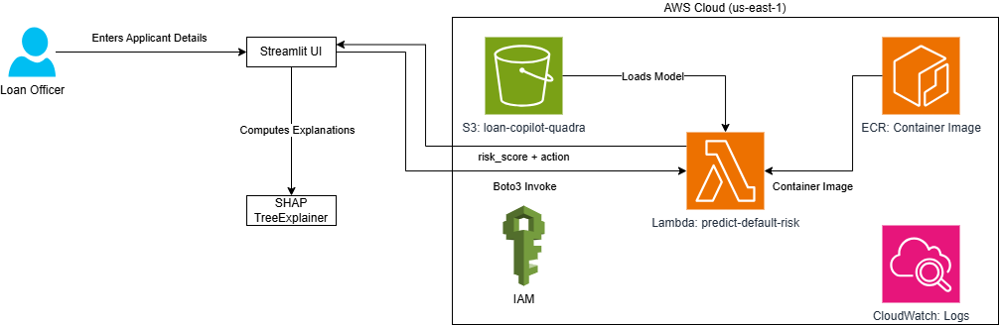

# Loan Underwriting Copilot

An end-to-end credit risk prediction system built for loan officers. Enter an applicant's profile → get an instant **APPROVE / REVIEW / REJECT** decision with SHAP-powered explanations, scenario analysis tools, and PDF audit reports.

Built during my internship at **Quadra Systems** (AWS Partner) as a production-ready demonstration of classical ML + serverless cloud deployment.

---

## Demo



**Flow:**
```
Loan Officer fills form (Streamlit UI)
        ↓
Input validation + feature engineering (29 features)
        ↓
AWS Lambda (LightGBM inference — ~8ms warm)
        ↓
SHAP TreeExplainer (per-prediction explainability)
        ↓
Decision card + Risk factor breakdown + PDF report
```

---

## Key Metrics

| Metric | Value |
|--------|-------|
| Model | LightGBM (Gradient Boosted Trees) |
| ROC-AUC | **0.759** on holdout test set |
| Training data | 307,511 loan applications (Home Credit) |
| Features engineered | 29 (13 numeric + 16 categorical) |
| Inference latency | ~8ms warm / ~10s cold start (Lambda) |
| Monthly cost | ~$1.20 for 30,000 invocations |
| Cost at rest | $0 (serverless) |

---

## Features

- **3-tier decision engine** — APPROVE (<15%), REVIEW (15–50%), REJECT (>50%) with configurable thresholds
- **SHAP explainability** — Plotly bar chart showing top 5 features driving each decision, with plain-English toggle
- **Business rule overrides** — Zero-income and extreme debt-burden edge cases handled explicitly
- **What-If Scenario Analyzer** — Tweak income / loan / credit score and see if the decision flips
- **Quick Assessment Mode** — 5-field instant triage in under 30 seconds
- **Batch Assessment** — Upload a CSV of applicants, download predictions in bulk
- **PDF reports** — Downloadable audit trail with decision, inputs, and SHAP factors
- **Session history** — Every assessment logged, exportable as CSV
- **3-layer fallback** — Lambda → local LightGBM model → error banner (never crashes)

---

## Architecture

| Layer | Technology |
|-------|-----------|
| UI | Streamlit (dark theme, custom CSS) |
| ML Model | LightGBM + scikit-learn pipeline |
| Explainability | SHAP TreeExplainer |
| Inference API | AWS Lambda (container image) |
| Model storage | Amazon S3 |
| Container registry | Amazon ECR |
| Narrative AI | Amazon Bedrock (Nova Pro) |
| Monitoring | Amazon CloudWatch |

---

## Project Structure

```
loan-underwriting-copilot/
├── streamlit_app.py              # Main UI (~1,500 lines)
├── lambda/
│   ├── lambda_function.py        # AWS Lambda inference handler
│   ├── Dockerfile                # Container image (Python 3.11)
│   ├── requirements.txt
│   └── DEPLOY_INSTRUCTIONS.md    # Step-by-step CloudShell deploy guide
├── Datasets/
│   ├── HomeCredit_LoanUnderwriting_v1.ipynb  # Full ML pipeline (67 cells)
│   ├── lgbm_booster.txt          # Trained LightGBM model
│   ├── preprocessor.pkl          # Fitted sklearn ColumnTransformer
│   └── Dataset_Exploration.ipynb
├── fit_preprocessor.py           # Script to re-fit preprocessor
├── test_lambda.py                # Integration tests (6 applicant profiles)
├── api-schema.json               # OpenAPI 3.0 schema
├── MODEL_CARD.md                 # Fairness, limitations, governance
├── Cost_Estimation.md
├── Requirement_Summary.md
└── .streamlit/config.toml        # Dark theme config
```

---

## How to Run Locally

```bash
# 1. Clone the repo
git clone https://github.com/kaustubhkalpathy/loan-underwriting-copilot.git
cd loan-underwriting-copilot

# 2. Install dependencies
pip install streamlit boto3 lightgbm scikit-learn shap numpy pandas plotly fpdf2

# 3. Run the app
streamlit run streamlit_app.py
```

Opens at **http://localhost:8501**

> Works fully offline — falls back to local LightGBM model if AWS Lambda is unavailable.
> AWS credentials are only needed to use the Lambda inference endpoint and Bedrock narrative feature.

---

## Dataset

Training data: [Home Credit Default Risk](https://www.kaggle.com/competitions/home-credit-default-risk/data) (Kaggle)

- 307,511 loan applications, 122 raw columns
- Target: 1 = defaulted, 0 = repaid (8% / 92% split)
- Dataset not included in this repo due to size (158 MB) — download from Kaggle and place at `Datasets/application_train.csv`

---

## AWS Deployment

| Resource | Details |
|----------|---------|
| Lambda function | `predict-default-risk` — container, 1024 MB, 5 min timeout |
| S3 bucket | `loan-copilot-quadra` — stores model + preprocessor |
| ECR repository | `predict-default-risk` — Docker image |
| Region | `us-east-1` |

See `lambda/DEPLOY_INSTRUCTIONS.md` for full step-by-step deployment using AWS CloudShell.

---

## Tech Stack


---

## Internship Context

Built at **Quadra Systems** (AWS Partner) — June 2026
Mentor: Anna | Tools: Kiro IDE, AWS Console, Jupyter Notebook

This project demonstrates end-to-end ML engineering: raw data → feature engineering → model training → cloud deployment → explainable UI.
